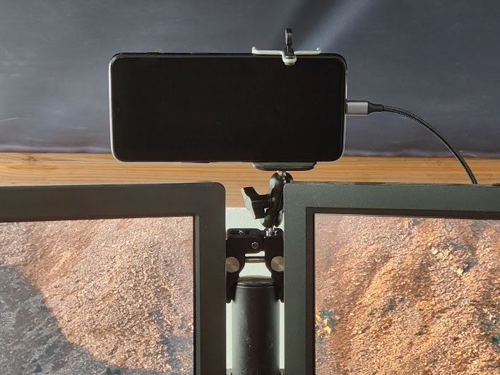

+++
title = "How to Use Your Android Device as Webcam on Linux"
date = 2021-06-26T14:33:00+00:00
description = "I'll showcase how I used my Android phone to create a webcam that works with virtually any web-conferencing software, can be positioned freely anywhere on my desk and has much better quality than the ordinary peripherals we see a lot these days."

[taxonomies]
tags = ["Post", "Workspace"]

[extra]
author = "Hendrik Maus"
+++

I love to work from home. And I like my workspace to be ergonomic as well. Ergonomics at the workplace is usually something you do for yourself, however recently I did some improvements for everybody who interacts with me in order to improve their experience as much as I can from where I stand (or sit, most of the time):

- a condenser microphone, mounted to a movable arm
- a solution to improve my video angle and quality

## My Solution



I had an Android phone which was not being used for anything else and I stumbled upon [IP Webcam](https://www.appbrain.com/app/com.pas.webcam).

The phone is held in place by a spring-loaded smartphone adapter for regular tripods. It is screwed onto a double sided ballhead which is mounted to a clamp. This allowed me to position the camera straight ahead of me, slightly higher than eye-level. It is a very positive and rigid fit, so operating the phone is not an issue while it is mounted.

The [IP Webcam](https://www.appbrain.com/app/com.pas.webcam) app allows me to expose the device's camera(s) via TCP on the local network.

> If you are a tech-savvy person, you might immediately think _"That setup fails the moment you connect to a VPN without spending some time on network routes."_ and I thought the same, however this problem is bypassed by the solution that follows.

Getting that to work was done very quickly and was a plug n' play experience:

I plugged the phone into one of my USB ports, as it will need power anyway, opened IP Webcam, hit "Start server" and opened up the IP address it presented me with in my browser.

You'll get to see a configuration interface that allows for tweaking some settings like using the front- or back-facing camera, autofocus etc.

I opted to use the front-facing camera, so it would be easier to operate the phone while it is mounted in place. The quality is far more than enough with this Oneplus 6T.

By this time, I was already so pleased with the experience, and the possibilities it opened up, that I went ahead and purchased the pro version to support the developer. One could easily reuse older hardware to build a two-way wifi baby-phone, monitor a 3D printer, watch some plants grow and timelapse that and whatnot.

Next, I wanted to make the setup work with the video-conferencing software we use at work. I spent a bit of time on the net and ended up at [ipwebcam-gst](https://github.com/bluezio/ipwebcam-gst/) on GitHub.

I cloned the repository to disk and ran:

```shell
sudo ./install-videochat.sh
```

> Please mind that you might have to dig through installing some missing dependencies on your system. For example, you will need Android's `adb` tool.

And then I created an alias for me called `ipcam` that runs:

```shell
~/ipwebcam-gst/run-videochat.sh --width 1280 --height 720 --video
```

With the phone plugged into USB, the IP Webcam server running and Android's `adb` installed, this creates a video device in 720p with video only. If you want to use the phone's microphone, omit `--video`. The video device is accessed via USB, not via WiFi, which makes for great performance and avoids the aforementioned VPN problem.

> What would that mysterious problem be? Well, if you connect to a VPN, you will usually lose access to your local network's IP space. So your IP cam wouldn't be usable anymore as its address wouldn't be reachable. Of course, that can be solved, but it saved time to avoid the issue.

I restarted the conferencing software and was then able to choose the new video device in the camera settings. Done.

## Conclusion

With a little bit of effort I was able to upcycle an otherwise dust gathering device and improve the experience for everyone working with me. I immediately got positive responses from the folks I tried the new camera setup with. Most of the joy sparked from the straight-on angle the camera is at, because I used to use my laptop's lid-camera which is way off to the side on my desk. Also, the video quality was pointed out to me as being superb.

All together it took maybe an hour to get everything rigged up and installed.

A really quick glance at a couple of search queries on the net, I saw that you can do the same thing with other operating systems on both computer and phone. So if you own different hardware, give it a go and see what you end up with.

## Alternatives Considered

To be perfectly honest, this was the third solution I looked into in the last 1.5 years. I started by trying to utilize a single board computer with a camera module, but I couldn't get it to work as USB cam back then. Next I tried to upcycle an action cam I have, but failed due to proprietary software boundaries (I guess).

I got wind of the solution described in this post in a side sentence from Linus on Linus Tech Tips on YouTube - thanks Linus!

## Some Quirks

Sometimes the connection to the phone via `adb` is messed up after the computer woke up from sleep or hibernation. That is easily fixed by running:

```shell
adb kill-server
```

And then restarting ipwebcam-gst.

Another thing I've noticed is that the video device shows a black picture if I start ipwebcam-gst _after_ starting the video conferencing software. It is fixed by restarting the conferencing program.

If you'd like to add something to the list, feel free to leave a comment.
