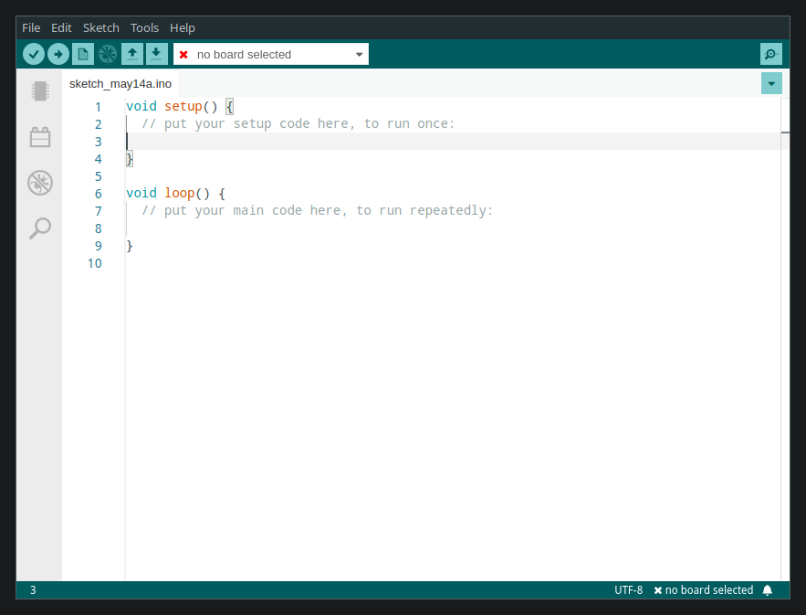
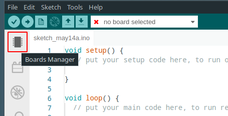
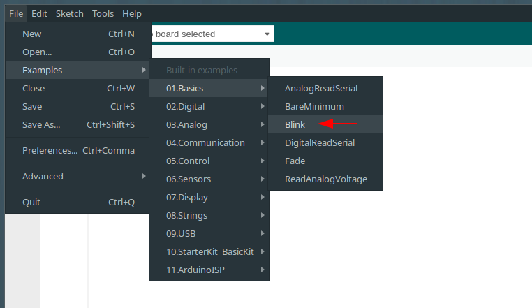
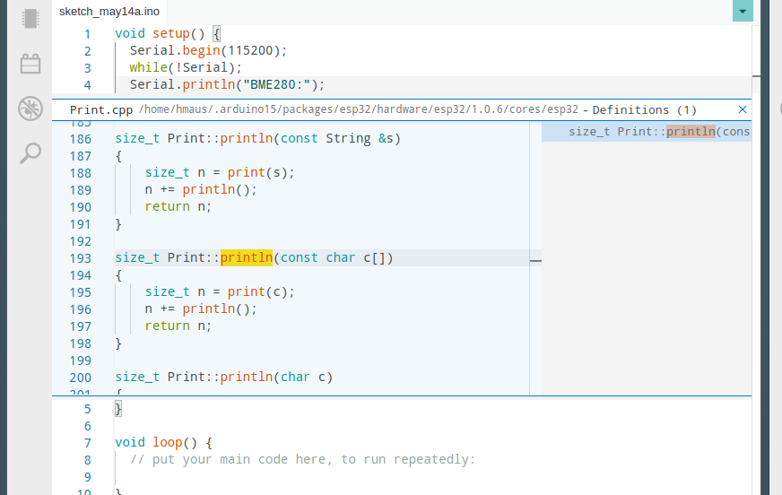
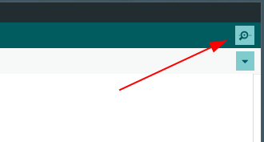

+++
title = "Taking a Look at Arduino IDE 2 beta"
date = 2021-05-14T12:39:00+00:00
description = "I am taking the beta release of Arduino IDE v2 for a testrun using an ESP32 and a temperature + humidity sensor."

[taxonomies]
tags = ["Post", "Microcontroller"]

[extra]
author = "Hendrik Maus"
+++

Today I want to take a look at beta release 5 of the new Arduino IDE 2. I will be using an ESP32 board and a temperature + humidity sensor to build a very simple sketch, which will print the values to the serial monitor.

The article will cover:

- Using Espressif boards with the Arduino IDE 2
- Downloading a library to interact with the sensor (BME280)
- Using the serial monitor to see the measurements
- Notes along the way

_If you come across this article at a later time, a lot might have changed in regards to the Arduino IDE. Keep in mind that this article is using a **beta** release._

You can follow along, however I did not intend this article to be a learning resource.

## Foreword

I am working with Manjaro Linux, which is an Arch Linux based distribution. Hence all my references on installing software and fixing issues will focus on Arch Linux users.

I am using `paru` as package manager on my system as it allows me to easily work with the AUR.

If you are following along on another operating system, you'll need to find out the corresponding steps for your setup on your own.

## Installation

At the time of this writing, the AUR already includes a package to install the v2 beta package:

```shell
paru -S aur/arduino-beta-bin
```

_You can find the download links for your operating system on [arduino.cc](https://www.arduino.cc/en/software) in the "Experimental Software" section further down on the page._

> Aside: You can install both versions of the Arduino IDE side-by-side on the same system.

## First Launch

When you first launch the IDE, you'll immediately recognize the resemblance to multiple other IDE's/editors which are currently floating around the internet. This is because the front-end of the IDE is based on the [THEIA](https://theia-ide.org) IDE framework.

> Aside: Arduino IDE 2 is a complete rewrite of the project and shares no code with version 1.
> The front-end is built using TypeScript, the back-end is built using Golang.



Compared to `v1`, we have a couple more options available out of the box. Personally, I still think the layout is very clean and de-cluttered enough to maintain the simplicity, which the Arduino IDE is so well known for.

## Installing Espressif Boards

A fresh install won't have any boards available; they need to be installed through the "Boards Manager".

> Aside: The new IDE shares a lot of the underlying data with any previous install you might have. So if you've been working with Espressif boards in Arduino IDE v1, you will find the boards are already available.

The new IDE layout features a sidebar on the left hand side. The first icon opens the boards manager:



You can also access the boards manager in the traditional way, by using the "Tools > Board > Boards Manager" menu or by hitting `Ctrl + Shift + B`.

However, searching for Espressif boards will not yield any result. We first need to add another source URL to the boards managers configuration. This is the same as with `v1`. A plugin, combined with a very simple setup wizard, could ease this process a lot.

Open the application preferences `Ctrl + ,` and paste

```
https://dl.espressif.com/dl/package_esp32_index.json
```

into the field labeled "Additional boards manager URLs" and click OK.

> If you're running into issues, check out this super detailed guide over on [Random Nerd Tutorials](https://randomnerdtutorials.com/installing-the-esp32-board-in-arduino-ide-windows-instructions/). It is written for `v1`, but the steps are very much the same for `v2`.

Now, with the boards manager open, type "ESP32" into the search bar and install "**esp32** by **Espressif Systems**".

## Connect The ESP32

Before you plug in the board, make sure to install the base tool-stack as recommended by the official [Espressif documentation](https://docs.espressif.com/projects/esp-idf/en/latest/esp32/get-started/linux-setup.html):

```shell
paru -S --needed gcc git make flex bison gperf python-pip cmake ninja ccache dfu-util libusb
```

You'll also need the Python module `pyserial`, install it using `pip`:

```shell
pip install pyserial
```

Last but not least, your user will not be able to use the serial port without being part of the correct group:

```shell
sudo usermod -a -G uucp $USER
```

> On other Linux systems, it will most likely be the `dialout` group.

Make sure to re-login so the setting applies.

Now plug in the ESP32 board via USB and verify that the connection using:

```shell
sudo dmesg | grep tty
``` 
And it should print something like:

```
[  320.769260] usb 5-2.3.1: cp210x converter now attached to ttyUSB0
```

Aside: a _very_ common issue in this area is a faulty USB cable. There is a very informative video, including instructions on how to test your cables, over on [YouTube by Andreas Spiess](https://www.youtube.com/watch?v=n70N_sBYepQ).

Once you are certain your microcontroller is hooked up to your computer, you can follow me to the next step.

## Flash The Blink Sketch

Whenever I start working with a microcontroller, I will establish that a known scenario works: blinking the on-board LED. This is a convenient method to assert that your setup is working, i.e. you can flash the MCU (Microcontroller Unit).

Open up the Arduino IDE 2 beta and load the blink example via "File > Examples > 01.Basics > Blink":



As with `v1`, this will open a new window and you can close the previous one. I'd propose to improve this behavior by prompting for opening either in "This Window" or "New Window".

Now use the board selector to pick the serial port you saw in the `dmesg` output, `ttyUSB0` for me:


Since the IDE does not yet know which type of board is connected to the serial port, it will prompt you to select a model. Find your model and click OK. This is very nicely done; I am pleased with the experience as it is very explicit.

Now the bottom right corner should show the selected board and the serial port:


You can now hit the upload button, which is still located in the main menu bar on the top left side. It is the circle with the arrow pointing to the right. If it were up to me, I'd replace the pictogram with a "play" icon. This icon is commonly used in other IDE's when a button indicates that it runs something.

The bottom of the screen will open a progress panel. It can be toggled using a tiny button in the bottom menu next to the notification bell. The keyboard shortcut is `Ctrl + j`.

## Interim Conclusion

The Arduino IDE v2 beta retained much of its simple interface. Working with 3rd-party boards still requires you to go through the same process as before. So far, the experience is very much in line with `v1` and I am quite pleased with it.

Let's connect the sensor and then write some code to find out if the editing experience was improved.

## Connecting The Sensor

I'll be connecting a BME280, which uses i2c. Here is the wiring "diagram":

```
Sensor		ESP32
------		-----
VCC		3V3
GND		GND
SDI (SDA)	GPIO18
SCK (SCL)	GPIO19
```

I'll not go any deeper into soldering etc. as there are many great guides out there already.

## Installing a Library

The library manager can be conveniently accessed using the sidebar on the left:


There is a little indicator on the left of the icon once clicked, but to me the contrast and size are not sufficient to immediately see what I have selected and opened at the moment. Also, one can drag and drop the icons within the sidebar to change their order, which was somehow confusing to me as I accidentally actuated the feature. Anyhow, in the open library manager, search for "BME280" and install "**Adafruit BME280 Library** by **Adafruit**".

The library has a dependency, so the new IDE will prompt us to select what to do. I find that very pleasing as I prefer to explicitly know my code's dependencies. At least to some level. 

Click "Install all" to continue:


## Write Some Code

It is time to write some code and see some measurements. Open a new sketch and close the blink sketch's window.

Move into the `setup` function and start typing `Serial.`. You'll be greeted with one of the most noble new features of the Arduino IDE 2 - **Auto-completion**:


Continue typing `beg`, we're looking for the `begin` method on `Serial`. You'll see the preview of the signature, and once we hit `enter`, the editor will insert a piece of pre-selected code for us to fill in. Now this is pretty helpful, especially it being pre-selected, so we can start typing right away. However, I am not very comfortable with the ergonomics - that is very subjective though since I am used to Jetbrains IDE's and their approach to live templates. I reckon there is a plugin for THEIA based IDE's to get something close.

Some other features of the new editor include the automatic completion of parenthesis and co. For example, type `(` and the editor will insert the closing `)` for you.

Also quite useful is the "peek into" function, which will display a peek into another function inline:



A huge win for any Arduino IDE enthusiast is the ability to refactor the names of things. Previously, you would use search&replace which works fine as long as your code-base is tiny. The IDE `v2` is context-aware and will only replace an entities' name if it is bound to the same scope. Andreas Spiess covers this topic in [his video about the Arduino IDE 2](https://www.youtube.com/watch?v=nlI_5vxm3bk&vl=en) more extensively.

You will find a lot of familiar editing functionality if you've ever worked with another THEIA based IDE before.

Let's complete a very basic sketch to read the BME280 sensor and print its values to the serial monitor every 2 seconds:

```c
#include <Wire.h>
#include <Adafruit_BME280.h>

#define SEALEVELPRESSURE_HPA (1013.25)
#define SCL_PIN 19
#define SDA_PIN 18
#define I2C_FREQ 400000

TwoWire I2CBME = TwoWire(1);
Adafruit_BME280 bme;

void setup() {
  Serial.begin(115200);

  // wait for serial to start
  // without it, we cannot print anything
  while(!Serial);

  // Start the i2c bus
  I2CBME.begin(SDA_PIN, SCL_PIN, I2C_FREQ);
  
  // Start the bme sensor
  // Please mind that your address _might_ be different
  Serial.println("Connecting to sensor:");
  while (!bme.begin(0x76, &I2CBME)) {
    Serial.print(".");
    delay(10);
  }

  Serial.println("connected");
  Serial.println();
}

void loop() {
    Serial.print("Temperature = ");
    Serial.print(bme.readTemperature());
    Serial.println(" °C");

    Serial.print("Pressure = ");
    Serial.print(bme.readPressure() / 100.0F);
    Serial.println(" hPa");

    Serial.print("Approx. Altitude = ");
    Serial.print(bme.readAltitude(SEALEVELPRESSURE_HPA));
    Serial.println(" m");

    Serial.print("Humidity = ");
    Serial.print(bme.readHumidity());
    Serial.println(" %");

    Serial.println();

    delay(2000);
}
```

Upload the code.

## The Serial Monitor

After uploading the code, the IDE does nothing. I would appreciate it recognizing activity on the serial port and switching to the monitor (or at least have this configurable, if it is not accepted as a sane default.)

The icon to switch to the serial monitor is at the very top right hand side of the view:



Otherwise, `Ctrl + Shift + M` will open it up as well.

The first thing you want to do is match the baud rate:


Then you can start to appreciate the sensor values being printed every 2 seconds.

The serial monitor allows to toggle auto scrolling as well as timestamps, which can be very useful from time to time.

## Aside on The Debugger

I was looking forward to the line debugging feature of the new Arduino IDE, however it only supports Arduino boards, not Espressif boards:


One can only hope that either Espressif Systems or the community will implement it in the future.

I oppose "print-line-debugging" whenever I see it. Once you have experienced using a proper debugger, you might switch sides to me too.

## Conclusion

Overall **I am very pleased** with the new version of the Arduino IDE. It being a beta, I expected some bugs, however I did not run into a single one on my way through writing this article. I felt very comfortable from the first moment, due to the usage of the THEIA IDE framework. However, the team did not tap into plugins at all as it looks. I sincerely hope that the Arduino IDE is going to open up to extending and customizing the editor using the plethora of extensions out there. I reckon that many of the plugins built for other THEIA based IDE's can be installed right away.

I've been using PlatformIO in other editors in the past, just because working with Arduino IDE `v1` was a pretty unfulfilling editing experience. However, using PlatformIO introduces an amount of complexity which is often distracting and not required for the job. I will keep using the Arduino IDE 2 for a certain kind of project, as it is now a rich editing experience combined with the simplicity that Arduino IDE is so well known for.

Great job Arduino!

## Further Reading

- [Official Blog Post](https://blog.arduino.cc/2021/03/01/announcing-the-arduino-ide-2-0-beta/)
- [Source Code in GitHub](https://github.com/arduino/arduino-ide)
- [Underlying Framework, THEIA](https://theia-ide.org)
- [Espressif - Standard Setup of Toolchain for Linux](https://docs.espressif.com/projects/esp-idf/en/latest/esp32/get-started/linux-setup.html)
- [Espressif - Establish Serial Connection with ESP32](https://docs.espressif.com/projects/esp-idf/en/latest/esp32/get-started/establish-serial-connection.html#linux-dialout-group)
