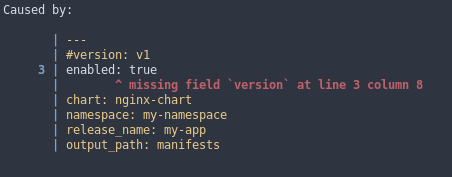

+++
title = "Rust: Render `serde` Errors For Humans Using `format_serde_error`"
date = 2021-08-31T00:00:00+00:00
description = "Render `serde` errors for humans to make mistakes in configuration files more accessible using the `helm-templexer` as an example for the implementation."

[taxonomies]
tags = ["Post", "Rust", "Software"]

[extra]
author = "***REMOVED***"
+++

## Foreword

The [`serde`](https://crates.io/crates/serde) crate is certainly one of the finest tools in the box. I rarely work on a project that does not make use of it; most of the time it is a user-facing usage - prominently: configuration files.

Now, humans make mistakes, and I think software should be blameless and helpful if one makes a mistake using it. I think very highly of the Rust compiler, because it does not only tell me *when* I made a mistake, but it also *visualizes* it nicely for me. The tip of the iceberg is reached, when `rustc` also tells me *how to fix* the error and write better code.

Today, I want to demo a crate that helps visualize errors that happen when one makes a mistake in a configuration file. Since one of my open-source tools, the [`helm-templexer`](https://github.com/hendrikmaus/helm-templexer), is a prime candidate, I'll use it for this purpose.

> Aside: [`helm-templexer`](https://github.com/hendrikmaus/helm-templexer) might be useful asset to you as well, if you work with Helm as template tool for Kubernetes manifests. It is useful if you need to render Helm charts with (slightly) different settings for, say, edge, stage and multiple production tiers of your online service.

## Implementation For `helm-templexer`

Let's start by creating a branch:

```shell
git switch -c format-serde-error
```

> Aside: in case you haven't yet seen [`git switch`](https://git-scm.com/docs/git-switch); to be honest, this was the only reason I showed how I created a branch here.

Add `format_serde_error` to `Cargo.toml`:

```shell
format_serde_error = "0.3"
```

> Please check for the latest version whenever you read this. Spoiler alert: `0.3` does not contain everything I am showing you today, but the `main` branch does.

### Status Quo

Next we'll go to the spot where `helm-templexer` attempts to read and deserialize its configuration file:

```rust
// src/config.rs:67
pub fn load<S: AsRef<Path>>(file: S) -> anyhow::Result<Config> {
    Self::check_file_exists_and_readable(file.as_ref())?;

    match serde_any::from_file(file) {
        Ok(cfg) => Ok(cfg),
        Err(err) => Err(anyhow!(
            "Failed to load configuration from file, because:\n{:?}",
            err
        )),
    }
}
```

This function accepts the path to a configuration file and checks if it exists and is readable by the current process.

Next the `serde_any` crate is used to try and deserialize whatever format the given file is in. If the code fails, a generic error is returned.

The error message will look like so, when we try to use a configuration file without the required `version` key:

```txt
Error: Rendering failed

Caused by:
    Failed to load configuration from file, because:
    YAML error: missing field `version` at line 2 column 8
```

Of course, this error contains what one needs to know to fix it; the idea is to *visualize* the error on top of the configuration so that the mistake is easier to spot.

### Actual Implementation

The `helm-templexer` currently supports configuration files written in `json`, `yaml` and `toml`. However, `serde_any` supports other formats as well, which we want to ignore in our implementation.

> Actually, we decided to drop everything but `yaml` support on the tool while I was writing this article - if you are wondering right now while browsing its source code.

Lucky for us, `serde_any` has a public function `guess_format`, which we can use to determine the probable file format we're dealing with:

```rust
let format = serde_any::guess_format(&file)
    .ok_or_else(|| anyhow!("unable to determine configuration file format"))?;
```

Next, we'll read the config file into memory as a `String`.

```rust
let cfg = std::fs::read_to_string(&file)?;
```

Now we can use the `format` to match on the `serde_any::Format` enum - let's start with `yaml`:

```rust
match format {
    serde_any::Format::Yaml => {
        let cfg = serde_yaml::from_str::<Config>(&cfg)
            .map_err(|err| format_serde_error::SerdeError::new(cfg.clone(), err))?;
        Ok(cfg)
    }
    _ => bail!("unsupported config file format"),
}
```

So what is happening here:

- we have a `match` arm for `yaml` and one for `_`, which makes the statement exhaustive (everything except for `yaml` would fail right now).

  The `bail!` macro is part of the `anyhow` crate and allows us to fail the program there and then

- inside the `yaml` arm, we try to deserialize using `serde_yaml` into a `Config` struct

- if that fails, we map the error to `format_serde_error::SerdeError`, which does the magic formatting

  The "magic" is quite straightforward; the error returned by `serde_yaml` contains the line and column
  of the location within the configuration file at which it failed to deserialize.

  What `format_serde_error` does, is to get a couple of lines before and after that location,
  add some color and print the error:

  

Implementing the remaining format is as simple as:

```rust
match format {
    serde_any::Format::Yaml => {
        let cfg = serde_yaml::from_str::<Config>(&cfg)
            .map_err(|err| format_serde_error::SerdeError::new(cfg.clone(), err))?;
        Ok(cfg)
    }
    serde_any::Format::Json => {
        let cfg = serde_json::from_str::<Config>(&cfg)
            .map_err(|err| format_serde_error::SerdeError::new(cfg.clone(), err))?;
        Ok(cfg)
    }
    serde_any::Format::Toml => {
        let cfg = toml::from_str::<Config>(&cfg)
            .map_err(|err| format_serde_error::SerdeError::new(cfg.clone(), err))?;
        Ok(cfg)
    }
    _ => bail!("unsupported config file format"),
}
```

The only difference in the `match` arms is the crate called to deserialize the data (`serde_yaml`, `serde_json` and `toml`).

> Aside: when I started writing, the crate did not support `toml`; in my [pull-request](https://github.com/AlexanderThaller/format_serde_error/pull/15), you can see how straightforward it was to extend it. Don't hesitate to contribute to things you use; open-source is amazing.

The completed function looks like so:

```rust
pub fn load<S: AsRef<Path>>(file: S) -> anyhow::Result<Config> {
    Self::check_file_exists_and_readable(file.as_ref())?;

    let format = serde_any::guess_format(&file)
        .ok_or_else(|| anyhow!("unable to determine configuration file format"))?;

    let cfg = std::fs::read_to_string(&file)?;
    match format {
        serde_any::Format::Yaml => {
            let cfg = serde_yaml::from_str::<Config>(&cfg)
                    .map_err(|err| format_serde_error::SerdeError::new(cfg.clone(), err))?;
            Ok(cfg)
        }
        serde_any::Format::Json => {
            let cfg = serde_json::from_str::<Config>(&cfg)
                    .map_err(|err| format_serde_error::SerdeError::new(cfg.clone(), err))?;
            Ok(cfg)
        }
        serde_any::Format::Toml => {
            let cfg = toml::from_str::<Config>(&cfg)
                    .map_err(|err| format_serde_error::SerdeError::new(cfg.clone(), err))?;
            Ok(cfg)
        }
        _ => bail!("unsupported config file format"),
    }
}
```

Before I contributed it, there was no `toml` support, but the crate was still able to let me display the error using its custom error type:

```rust
serde_any::Format::Toml => match toml::from_str::<Config>(&cfg) {
    Ok(cfg) => Ok(cfg),
    Err(err) => {
        let (line, column) = err.line_col().unwrap_or_default();
        Err(format_serde_error::SerdeError::new(
            cfg.clone(),
            (err.into(), Some(line), Some(column)),
        )
        .into())
    }
},
```

As mentioned earlier, we decided to focus on `yaml` support in the `helm-templexer` while I was writing this article. So the final implementation looks even cleaner as there is no need to guess the format:

```rust
pub fn load<S: AsRef<Path>>(file: S) -> anyhow::Result<Config> {
    Self::check_file_exists_and_readable(file.as_ref())?;

    let cfg = std::fs::read_to_string(&file)?;
    let cfg = serde_yaml::from_str::<Config>(&cfg)
        .map_err(|err| format_serde_error::SerdeError::new(cfg.clone(), err))?;
  
    Ok(cfg)
}
```

## Conclusion

I think the [`format_serde_error`](https://github.com/AlexanderThaller/format_serde_error) crate is a great contribution to the toolbox and a helpful addition to `serde` for many user facing implementations. It is about to stabelize its user-facing api with a `1.0` release, but there are yet formats that could be supported.
