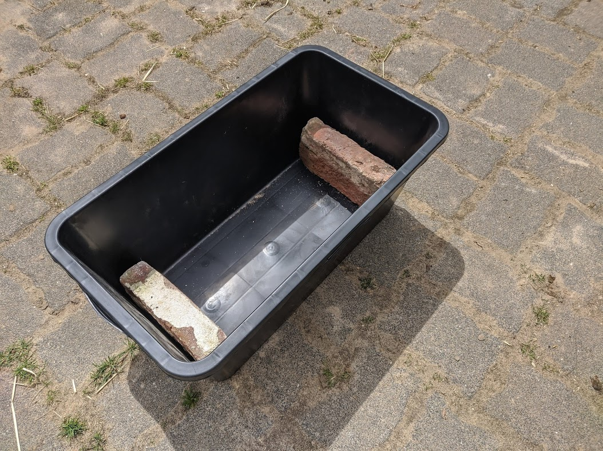
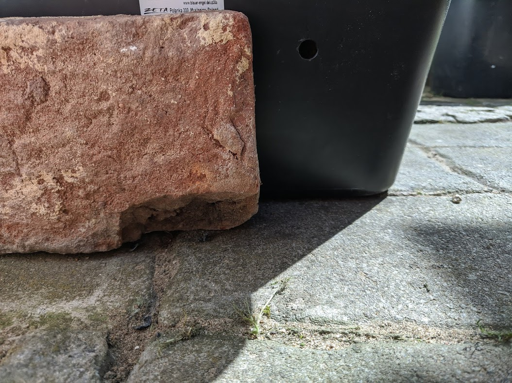
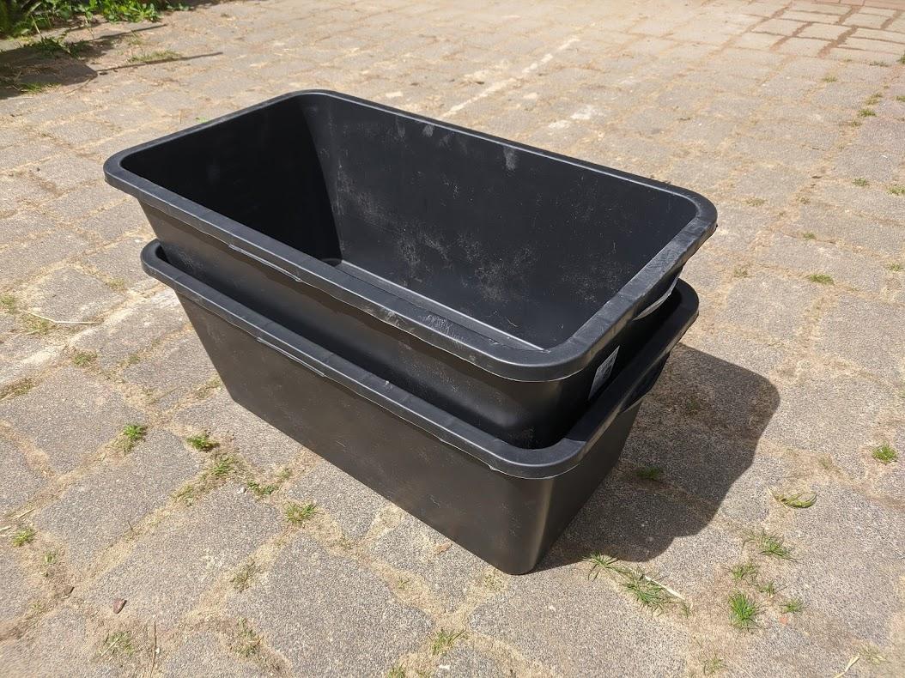
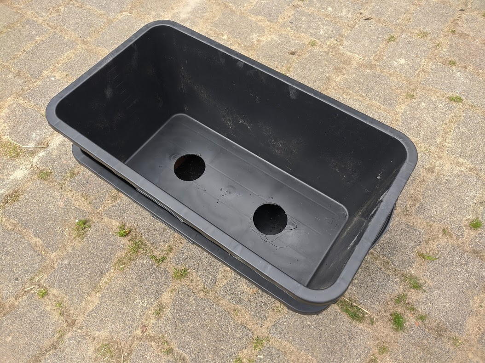
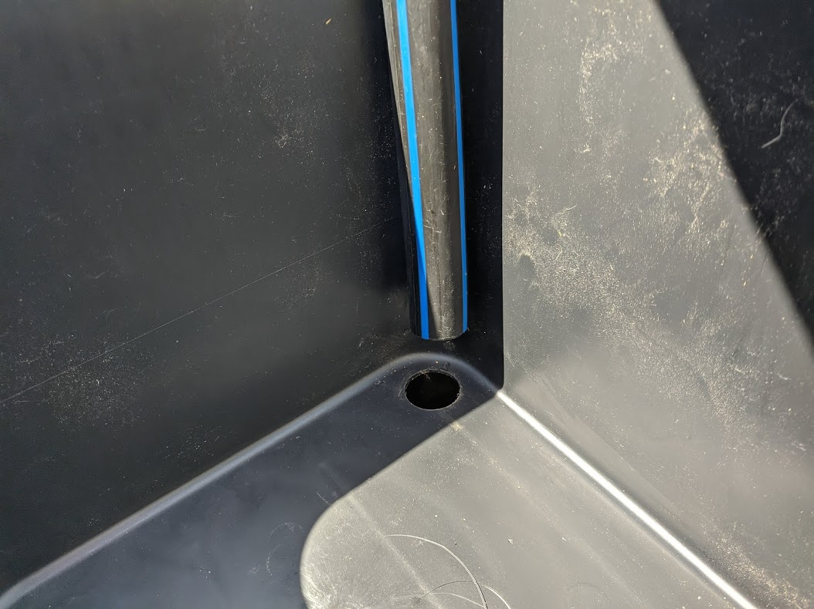
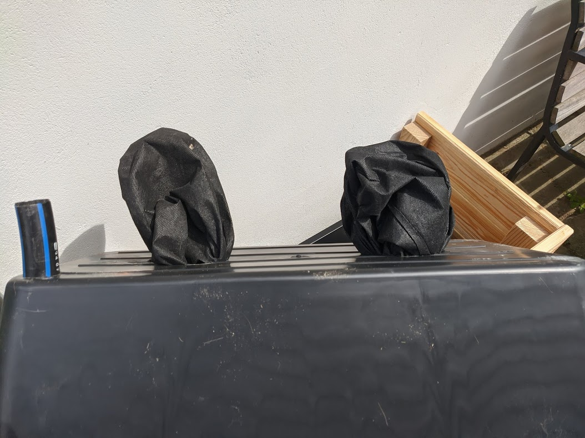
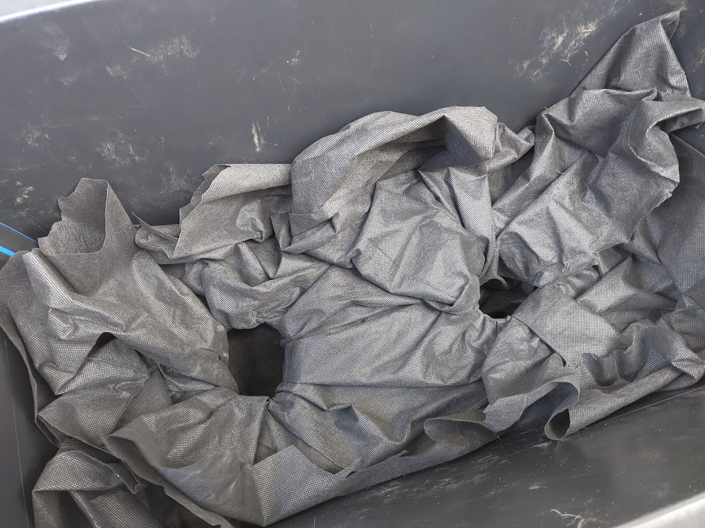
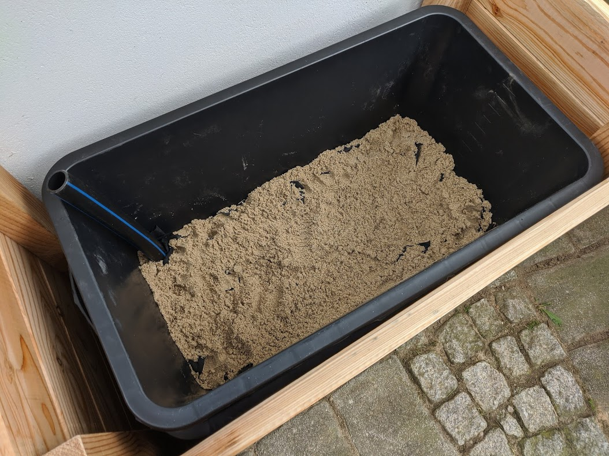
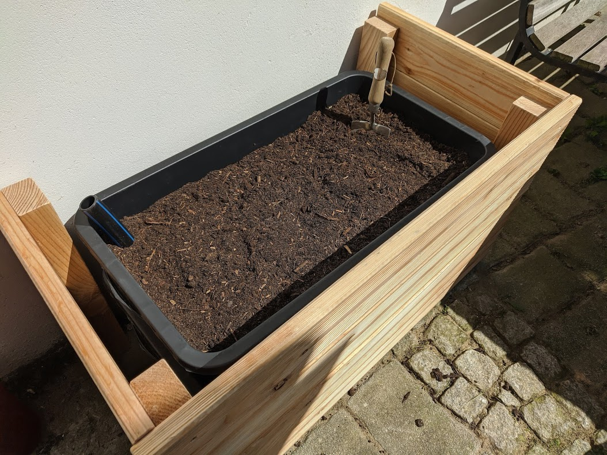
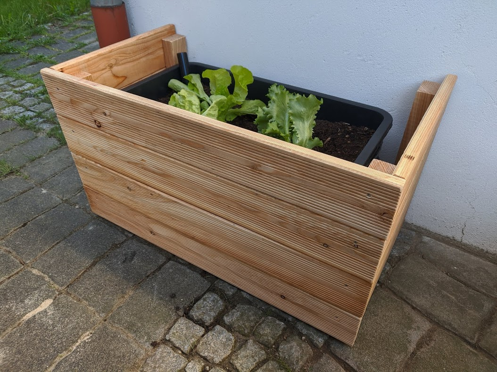

+++
title = "How to Save Water And Time by Building a Self Watering Planter"
date = 2021-05-21T19:43:00+00:00
description = "How to build a self watering planter to save water, time and use your fertilizer more efficient."

[taxonomies]
tags = ["Post", "Gardening", "DIY"]

[extra]
author = "Hendrik Maus"
+++

I am going to walk you through the process of building a self watering planter with readily available materials. Use less water overall and attend to your plants less often to give them said water. Use the concept of wicking, which you are familiar with if you've ever seen an oil lamp with a wick hanging down in a reservoir. Keep any fertilizer where it is being used without washing it all into the ground water. 

The planter itself takes around **30 minutes** to be built; if you add an enclosure, you're probably looking at around 2 hours of work.

_Since the cost aspect is subjective, I'll not get into it very much. If you must know, I payed ~20 EUR per planter (with potting mix, without enclosure) here in Europe. I built an enclosure out of Douglas Fir, so it'll last a long time outside, for ~30 EUR._

## Bill of Materials

Here is an overview of the materials used. The _italic comments_ are what I used specifically. 

### Planter

- 2x mortar tubs _65 liter, rectangular_
- 2x spacers _bricks_
- A piece of pipe _32mm PE, 400mm long_
- Some fabric _weed mat_
- Sand
- Potting soil _mix of universal and high quality mix_

### Enclosure

- Wood (timber beams, boards)
    - _1x 45x70x2500 mm Douglas Fir beam_
    - _4x 24x124x2000 mm Douglas Fir board_
- Screws _stainless steel_

### Tools

- Planter
  - Drill
  - Hole saw
  - Hack saw
  - 10mm drill bit
  - Shovel

- Enclosure
  - Hand saw
  - Sandpaper
  - 3mm drill bit
  - Countersink bit
  - Clamps
  - Pencil
  - Square
  - Screwdriver or bit

## Building The Planter

Start by placing your spacers in the bottom tub:

The height of your spacers determine the size of the water reservoir and the placement of your overflow bore. Choose a material that can withstand partial exposure to water over a long period of time without rotting or dissolving. Make sure that the spacers can support the weight of the upper tub.

Next, you can drill a hole so your planter has a chance to overflow if too much water is added to the system.

Place the hole a bit below the height of your chosen spacer. You can place the hole anywhere around the sides of your tub, keep in mind that will want to be able to see it when refilling the reservoir.

If you want to build an enclosure, now is the time to put your second tub on top of your spacers to get the final height of your planter.

The next step is to drill two large holes in the bottom of the upper tub. I used a 90mm hole saw.

_Aside: you can usually achieve a much cleaner bore by starting your drill backwards._

Be **very careful** when drilling these large openings by hand and hold on very tight to your drill - these things can transmit a lot of torque. If you are uncomfortable doing that, you can also cut these holes in the soft plastic using a utility knife just fine. They just won't be as pretty, but the function is unaffected by the roundness of the openings.

After drilling the two large holes, we need to drill a smaller one in a corner. The smaller hole should fit tight around the piece of pipe you have available. The piece needs to be long enough to reach donw into the reservoir, while being above the final soil level. You will use it to refill the reservoir. I picked a 400mm long piece of 32mm PE pipe and used a step drill which allowed me to precisely drill a 32mm opening.

_Aside: You can also drill a too large hole and later prevent the soil from dropping into the reservoir using some fabric._

I angled one of my spacer bricks slightly to have room for the pipe sticking down into the reservoir.

In order to create a wicking effect, we'll use a sheet of fabric to create two pockets that connect the upper tub to the water reservoir without letting the soil drop down into it. The pockets should be long enough to reach the bottom of the lower tub. 

I used some weed mat because it is easily available, doesn't rot too quickly and will allow for water to pass through it easily.

Make sure to use enough fabric to cover of the large holes. It wouldn't be too bad if some soil makes it down there, so don't get too picky. Here is how I've done it:

With the upper tub sitting on top of the spacers in the lower one, fill the pockets with sand:

Avoid lifting the upper tub until it is filled with soil. Otherwise, the weight of the sand might pull your fabric through the holes. Once the upper tub is filled with soil, there should be enough weight in there to prevent this from happening.

Fill the upper tub with potting mix:

I used a mixture of, what is called, "universal gardening" soil over here and some high quality potting mix. You should absolutely not shovel in the common dirt from your garden. Chances are that you will see no wicking at all or very bad performance. Depending of the type of soil you have on your property, it might all just become a very hard mass in there which rejects any kind of water.

Don't cheap out and consider this a long-term investment to make sure that your plants have a healthy environment to grow roots in. The filling of this planter can be recycled, re-fertilized and improved over time with your own compost etc. You will not have to go out and make this investment next season again.

Now you are ready to put some plants in.

Use a hose to fill the water reservoir using the pipe sticking out the top. Keep pouring until you see the water coming out of your overflow hole. Also, make sure to give the soil a fair bit of water from the top at first, because the wicking effect takes some time to kick in.

If you want to build the same enclosure that I built, here are some facts and measurements:

I used _one beam of Douglas 45x70x2500 mm_ for the corners. I cut it into multiple pieces, each _480 mm long_. The front and the sides are made from Douglas as well; I used _four 24x124x2000 mm boards_. The fronts are _900 mm_ and the sides are _450 mm_. You'll need _4 front boards_ and _eight side boards_.

Some clamps will come in handy during assembly. Make sure to pre-drill any holes to avoid splitting the wood and use stainless steel screws.

I left about 10 mm of space below the bottom boards so that the 4 beams sit on the ground, but the boards do not. I did not measure this step and simply put an off-cut of one of the boards on top of the beam and screwed the boards flush at the top. You can also add a frame on the top for better looks - I am considering it now that I see the final picture.

I built the enclosure so it is open on the back and I can pull it away at any time to access the planter itself. Once filled with soil and water, the planter will be very heavy. This way, I can easily access it later if I have to.

Of course, possibilities here are endless. However, do yourself a favor and use some wood that is rated for the outside, such as Douglas Fir, Oak or Larch. Many other species will rot very quickly.

## Conclusion

So what's the big deal?

Well, let me start with the most obvious point: you need to water your plants way less often and hence you **save time**.

The water that you add to the planter stays in the reservoir and will be available to the plants over a **longer period** of time, rather than sinking down into deeper levels, like it would happen in a common garden bed in the dirt. This also **greatly reduces the total amount of water** that you add over the course of the season. Also, your **fertilizers don't get washed out** into the ground. Of course, a very heavy rain will cause your reservoir to overflow and hence wash something away, but the loss is significantly smaller.

You can **create the particular environment** that your plants need. Some plants prefer richer environments, others leaner. Some cultures like an acidic soil environment, others do not.

If you've used good quality potting mix, there will be **fewer weeds** coming up. And, last but not least, you can grow plants without the need to have a large garden or a garden with dirt beds at all. You could perfectly build a couple of these for your balcony or patio.

Make sure to use quality materials, then you will be able to use this planter for many years to come.
